# 🧠BrainBytes AI Tutoring Platform

[🎤 BrainBytes Platform Demo](https://youtu.be/efyEETg2fL4)

## Project Overview
BrainBytes is an AI-powered tutoring platform designed to provide accessible academic assistance to Filipino students. This project implements the platform using modern DevOps practices and containerization.

## 📚 Table of Contents
- [Project Overview](#project-overview)
- [Team Members](#team-members)
- [Project Goals](#project-goals)
- [Technology Stack](#technology-stack)
- [Development Environment Setup Verification](#development-environment-setup-verification)
- [Sample Architecture](#sample-architecture)
- [Containerized Components](#-containerized-components)
- [Port Mappings](#-port-mappings)
- [Data Flow Diagram](#-data-flow-diagram)
- [AI Model Integration](#-ai-model-integration)
- [Data Storage](#-data-storage)
- [Observability Stack](#-observability-stack)
- [Future Improvements](#-future-improvements)
- [External Dependencies](#-external-dependencies)
- [Milestone Task Distribution](#-task-distribution)

## Team Members
- Jennifer Cerio - Backend Developer - [lr.jecerio@mmdc.mcl.edu.ph]
- Catherine De Guzman - Frontend Developer - [lr.cdguzman@mmdc.mcl.edu.ph]
- Krisha Danessa Jusay - DevOps Engineer - [lr.kdjusay@mmdc.mcl.edu.ph]

## Project Goals
- Implement a containerized application with proper networking
- Create an automated CI/CD pipeline using GitHub Actions
- Deploy the application to Render Cloud Free Tier
- Set up monitoring and observability tools

## Technology Stack
- Frontend: Next.js
- Backend: Node.js
- Database: MongoDB Atlas
- Containerization: Docker
- CI/CD: GitHub Actions
- Cloud Provider: Oracle Cloud Free Tier
- Monitoring: Prometheus & Grafana

Development Environment Setup Verification

# Development Environment Setup Verification

|      Team Member      | Docker Installed | Git Installed | VS Code Installed | Can Run Hello World Container |
|-----------------------|------------------|---------------|-------------------|-------------------------------|
| Cerio, Jennifer       | ✓                | ✓            | ✓                 | ✓                            |
| De Guzman, Catherine  | ✓                | ✓            | ✓                 | ✓                            |
| Jusay, Krisha Danessa | ✓                | ✓            | ✓                 | ✓                            |

## Docker Version Information
Docker version 28.0.4, build b8034c0

# Sample Architecture

## 🐳 Containerized Components

| Container        | Description                            | Port     |
|------------------|----------------------------------------|----------|
| `frontend`       | Next.js UI served via Node.js          | 3000     |
| `backend`        | Express.js API + Prometheus metrics    | 10000    |
| `mongodb`        | MongoDB database                       | 27017    |
| `prometheus`     | Metrics scraper                        | 9090     |
| `grafana`        | Dashboard visualization                | 3001     |
| `node-exporter`  | Host-level metrics collection          | 9100     |

## 🔁 Port Mappings

| Host Port | Container Port | Purpose                        |
|-----------|----------------|--------------------------------|
| `3000`    | `3000`         | Frontend client (Next.js)      |
| `10000`   | `10000`        | Backend API (Express)          |
| `27017`   | `27017`        | MongoDB database               |
| `9090`    | `9090`         | Prometheus UI                  |
| `3001`    | `3000`         | Grafana UI                     |
| `9100`    | `9100`         | Node Exporter metrics          |

## 🧭 Data Flow Diagram

## 🤖 AI Model Integration
- API Used: GROQ Inference API
- Location: Called via aiService.js in backend/services/
- Purpose: Generate AI-driven tutoring replies to user questions.
- Environment Variable: GROQ_API_KEY required in .env
## 🔐 Data Storage
- Session Data: Stored in MongoDB (sessions collection)
- User Data: (Optional) users collection
- Chat History: Tied to session/user
## 📈 Observability Stack
| Tool               | Function                                                                |
| ------------------ | ----------------------------------------------------------------------- |
| **Prometheus**     | Scrapes `/metrics` from backend & node-exporter                         |
| **Grafana**        | Dashboards for AI latency, traffic, system load                         |
| **Custom Metrics** | `brainbytes_ai_latency_seconds`, `brainbytes_http_requests_total`, etc. |
## 🧪 Future Improvements
- Redis cache layer for faster session reads
- Admin dashboard for user/session control
- Queue system for heavy AI workloads
## 🔗 External Dependencies
| Service        | Role                | Endpoint or Key         |
| -------------- | ------------------- | ----------------------- |
| **Groq**       | AI inference engine | `GROQ_API_KEY`          |
| **Docker Hub** | Container images    | `FROM node:18`, `mongo` |

## Task Distribution

### Week 1: Container Basics

**Catherine De Guzman**: Setup project repository and basic documentation  
**Jennifer Cerio**: Research and document containerization approach  
**Cerio, De Guzman, Jusay**: Complete Docker installation and verification  

### Week 2: Platform Development

**Catherine De Guzman**: Implement frontend container (Next.js)  
**Jennifer Cerio**: Implement backend container (Node.js)  
**Catherine De Guzman**: Configure MongoDB Atlas and connection

### Week 3: Platform Development (continued)

**Catherine De Guzman**: Implement chat interface frontend  
**Jennifer Cerio**: Implement backend API endpoints  
**Cerio, De Guzman**: Set up container networking

### Week 4: Integration and Testing

**Jennifer Cerio**: Integrate AI model  
**Jennifer Cerio**: Implement message history storage  
**Catherine De Guzman**: Create project documentation  
**Catherine De Guzman**: Final testing and preparation for submission

### Week 5: GitHub Actions Workflow
**Jennifer Cerio**: Setup GitHub Actions  
**Catherine De Guzman**: Implement GitHub Actions Workflow  
**Jennifer Cerio**: Create project documentation  
**Catherine De Guzman**: Final testing and preparation for submission

### Week 6: Tests in GitHub Actions
**Catherine De Guzman**: Automated Testing in CI/CD Pipelines  
**Jennifer Cerio**: Code Quality Checks  
**Catherine De Guzman**: Create project documentation  
**Jennifer Cerio**: Final testing and preparation for submission

### Week 7 & 8: CI/CD Implementation and Cloud Deployment
**Catherine De Guzman**: Setup Render.com for Container Deployment  
**Catherine De Guzman**: GitHub Actions CI/CD Integration with Cloud Platforms  
**Krisha Danessa Jusay**: Create project documentation  
**Jennifer Cerio**: Final testing and preparation for submission

### Week 9: Prometheus Setup and Basic Metrics Documentation
**Krisha Danessa Jusay**: Setup Prometheus  
**Catherine De Guzman**: Setup Basic Alerting  
**Krisha Danessa Jusay**: Create project documentation  
**Jennifer Cerio**: Final testing and preparation for submission

### Week 10: Advanced Dashboard Creation and Documentation
**Catherine De Guzman**: Setup Grafana and Basic Dashboards  
**Krisha Danessa Jusay**: Create project documentation  
**Jennifer Cerio**: Final testing and preparation for submission

