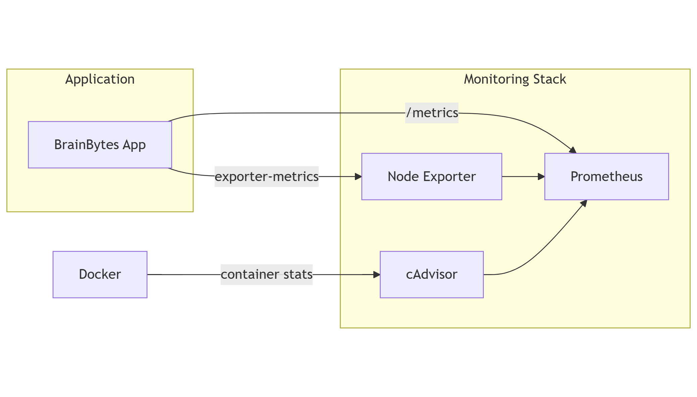

# 🧠 BrainBytes Monitoring Documentation

---

## 📡 System Architecture Overview

### Architecture Diagram

## 📦 Components Involved

| Component        | Description                                                                 |
|------------------|-----------------------------------------------------------------------------|
| **BrainBytes App** | The full-stack platform (frontend, backend, MongoDB) exposing `/metrics` via `prom-client`. |
| **Prometheus**     | Time-series monitoring system scraping application and system metrics.    |
| **Node Exporter**  | Collects host metrics (CPU, memory, disk, file descriptors).              |
| **Alertmanager**   | Routes alerts from Prometheus (to email, Slack, etc.).                    |
| **Grafana**        | Visualizes Prometheus data in real-time dashboards.                       |
| **Docker**         | Manages containerized services.                                           |
| **cAdvisor (planned)** | *(Optional)* For collecting detailed container stats *(not yet active)*. |

---

## 🔁 Data Flow

1. `prom-client` in the backend exposes `/metrics` with custom and default Node.js metrics.
2. Node Exporter exposes system-level stats at `:9100/metrics`.
3. Prometheus scrapes:
   - `backend:10000/metrics`
   - `node-exporter:9100/metrics`
4. All metrics are stored in Prometheus’ time-series database.
5. Alertmanager receives and routes firing alerts.
6. Grafana queries Prometheus for visualization and analytics.

---

## 📊 Metrics Catalog

### 🔧 System Metrics (Node Exporter)

| Metric                           | Type     | Description           | Labels           |
|----------------------------------|----------|-----------------------|------------------|
| `node_cpu_seconds_total`         | counter  | CPU time by mode      | mode, cpu        |
| `node_memory_MemAvailable_bytes` | gauge    | Available memory      | –                |
| `node_disk_io_time_seconds_total`| counter  | Disk I/O time         | device           |

---

### 🚀 Application Metrics (Backend via `prom-client`)

| Metric Name                                 | Type      | Description                          | Labels                      | Example Query |
|---------------------------------------------|-----------|--------------------------------------|-----------------------------|------------------------------|
| `brainbytes_http_requests_total`            | counter   | Total HTTP requests                  | method, endpoint, status    | `sum by (status)(rate(brainbytes_http_requests_total[1m]))` |
| `brainbytes_http_request_duration_seconds`  | histogram | Duration of HTTP requests (seconds)  | method, endpoint, status    | `histogram_quantile(0.95, rate(brainbytes_http_request_duration_seconds_bucket[5m]))` |
| `brainbytes_active_sessions`                | gauge     | Current active tutoring sessions     | –                           | `brainbytes_active_sessions` |
| `brainbytes_ai_requests_total`              | counter   | Total AI requests                    | model, status               | `sum(increase(brainbytes_ai_requests_total[1h]))` |
| `brainbytes_ai_response_duration_seconds`   | histogram | Duration of AI responses             | model                       | `avg(rate(brainbytes_ai_response_duration_seconds_sum[5m]))` |
| `brainbytes_questions_total`                | counter   | Total valid student questions        | –                           | `increase(brainbytes_questions_total[1h])` |
| `brainbytes_tutoring_sessions_total`        | counter   | Count of new tutoring sessions       | –                           | `increase(brainbytes_tutoring_sessions_total[1d])` |
| `brainbytes_session_duration_seconds`       | histogram | Duration of tutoring sessions        | –                           | `avg(rate(brainbytes_session_duration_seconds_sum[1h])) / rate(brainbytes_session_duration_seconds_count[1h])` |

---

## 📈 PromQL Queries

| Query                                                                                                 | Description                                      |
|-------------------------------------------------------------------------------------------------------|--------------------------------------------------|
| `rate(brainbytes_http_requests_total[1m])`                                                            | Requests per second by method and endpoint       |
| `sum by (status) (rate(brainbytes_http_requests_total[5m]))`                                         | HTTP status code breakdown                       |
| `histogram_quantile(0.95, rate(brainbytes_http_request_duration_seconds_bucket[5m]))`                | 95th percentile of HTTP request durations        |
| `increase(brainbytes_ai_requests_total[10m])`                                                        | Total AI requests in the last 10 minutes         |
| `rate(brainbytes_ai_response_duration_seconds_sum[1m]) / rate(brainbytes_ai_response_duration_seconds_count[1m])` | Average AI response time                         |
| `brainbytes_active_sessions`                                                                         | Current number of active sessions                |
| `increase(brainbytes_questions_total[1h])`                                                           | Number of questions asked in the last hour       |
| `topk(5, increase(brainbytes_http_requests_total[5m]))`                                              | Top 5 most requested endpoints                   |
| `rate(node_cpu_seconds_total{mode="idle"}[5m])`                                                      | CPU idle time — overall system health            |
| `rate(node_memory_MemAvailable_bytes[5m])`                                                           | Memory availability trend                        |
